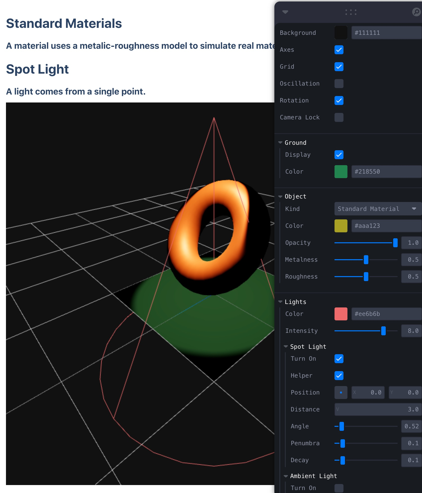

# Learn Three.js in REACT Way

> Demo: https://xjkit.github.io/learn-threejs-in-react-way/

<a href="https://threejs.org/" target="_blank" color="blue.500">Three.js</a> is an awesome library that makes the Web 3D development a lot easier.

### Why this demo site?
  When I begin three.js, from this <a href="https://github.com/mrdoob/three.js/blob/master/examples/webgl_animation_cloth.html" target="_blank"> official documentation code example</a>, creating **meshes**, **objects**, **materials**, **lights**, **render loops**, and so on in imperative way is not really my thing. Why not just create everything in <b>declarative, more functional, and component-based objects!</b> That is what React looks like.

  Special thanks to the three.js react renderer <a href="https://github.com/pmndrs/react-three-fiber" target="_blank">@react-three/fiber</a> which makes web 3d happen in React world.
